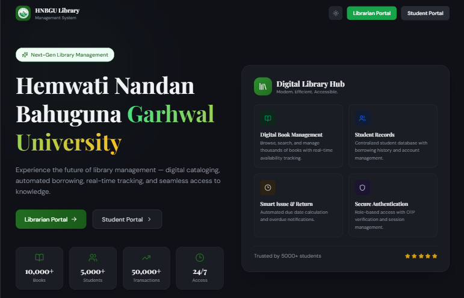
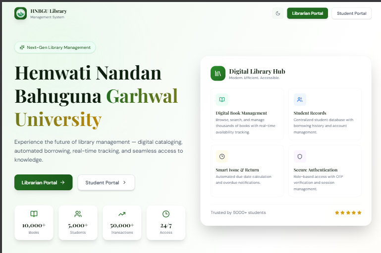
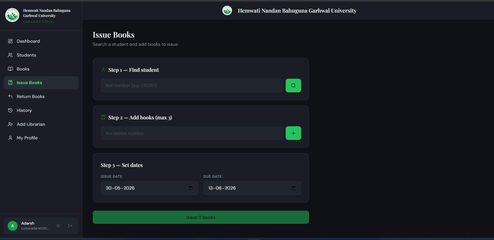

# 📚 HNBGU Central Library Management System

A full-stack web application for managing the central library of **Hemwati Nandan Bahuguna Garhwal University (HNBGU)**. The system provides separate portals for librarians and students, supporting book management, issuance, returns, and automated email notifications.

---

## 🖼️ Screenshots

### 🏠 Home / Landing Page



### 🔐 Login Pages


### 📊 Dashboards


### 📖 Book Issuance


---

## ✨ Features

### Librarian Portal
- 🔐 Secure login with JWT authentication
- 📊 Dashboard with library statistics
- 📚 Add, edit, and manage books (with CSV bulk import)
- 🎓 Manage student accounts
- 📤 Issue books to students
- 📥 Process book returns and track overdue fines
- 📜 View full transaction history
- 👤 Librarian profile management
- ➕ Add new librarians

### Student Portal
- 🔐 Secure login with roll number
- 📊 Personal dashboard with borrowed books
- 📜 View borrowing history
- 👤 Profile management

### System Features
- 🌙 Dark / Light theme toggle
- 📧 Automated email notifications (due reminders, overdue alerts) via Nodemailer
- ⏰ Scheduled background jobs (cron)
- 🛡️ Rate limiting, Helmet security headers, CORS protection
- 🔍 Full-text book search

---

## 🛠️ Tech Stack

### Frontend
| Technology | Purpose |
|---|---|
| React 18 | UI framework |
| Vite 6 | Build tool & dev server |
| Tailwind CSS 4 | Styling |
| React Router v6 | Client-side routing |
| Axios | HTTP client |
| Lucide React | Icons |
| React Hot Toast | Notifications |

### Backend
| Technology | Purpose |
|---|---|
| Node.js 24.x | Runtime |
| Express.js 4 | Web framework |
| MongoDB | Database |
| Mongoose 8 | ODM |
| JSON Web Tokens | Authentication |
| bcryptjs | Password hashing |
| Nodemailer | Email service |
| node-cron | Scheduled jobs |
| Helmet | Security headers |
| express-rate-limit | Rate limiting |
| Multer | File uploads |
| csv-parser / fast-csv | CSV import |

---

## 📁 Project Structure

```
HNBGU Library/
├── Backend/
│   ├── config/
│   │   └── db.js                  # MongoDB connection
│   ├── controllers/
│   │   ├── authController.js
│   │   ├── bookController.js
│   │   ├── historyController.js
│   │   ├── issueController.js
│   │   ├── librarianController.js
│   │   ├── notificationController.js
│   │   ├── profileController.js
│   │   ├── returnController.js
│   │   └── studentController.js
│   ├── middleware/
│   │   └── authMiddleware.js
│   ├── models/
│   │   ├── Book.js
│   │   ├── Issue.js
│   │   └── User.js
│   ├── routes/
│   │   ├── adminRoutes.js
│   │   ├── authRoutes.js
│   │   ├── bookRoutes.js
│   │   ├── historyRoutes.js
│   │   ├── issueRoutes.js
│   │   ├── returnRoutes.js
│   │   └── studentRoutes.js
│   ├── services/
│   │   ├── emailService.js
│   │   └── scheduler.js
│   ├── tests/
│   │   └── backend.test.js
│   ├── .env.example
│   ├── package.json
│   └── server.js
│
├── frontend/
│   ├── public/
│   │   ├── favicon.svg
│   │   └── hnbgu-logo.png
│   ├── src/
│   │   ├── api/
│   │   │   ├── axios.js
│   │   │   └── services.js
│   │   ├── components/
│   │   │   ├── AppShell.jsx
│   │   │   ├── ProtectedRoute.jsx
│   │   │   ├── ThemeToggle.jsx
│   │   │   └── ui/
│   │   ├── contexts/
│   │   │   ├── AuthContext.jsx
│   │   │   └── ThemeContext.jsx
│   │   ├── layouts/
│   │   │   ├── LibrarianLayout.jsx
│   │   │   └── StudentLayout.jsx
│   │   ├── pages/
│   │   │   ├── Landing.jsx
│   │   │   ├── auth/
│   │   │   ├── librarian/
│   │   │   └── student/
│   │   ├── App.jsx
│   │   └── main.jsx
│   ├── index.html
│   ├── package.json
│   └── vite.config.js
│
├── Screenshots/
├── sample_books.csv
└── sample_users.csv
```

---

## ⚙️ Getting Started

### Prerequisites

- **Node.js** v24.x or higher
- **MongoDB** (local or Atlas)
- **npm** or **yarn**
- A Gmail account with an [App Password](https://myaccount.google.com/apppasswords) (for email notifications)

---

### 1. Clone the Repository

```bash
git clone https://github.com/your-username/HNBGU-Library.git
cd "HNBGU Library"
```

---

### 2. Backend Setup

```bash
cd Backend
npm install
```

Create a `.env` file by copying the example:

```bash
cp .env.example .env
```

Edit `.env` and fill in your values:

```env
PORT=5000
NODE_ENV=development
MONGO_URI=mongodb://localhost:27017/hnbgu-library
JWT_SECRET=your_long_random_secret_min_32_chars
ALLOWED_ORIGINS=http://localhost:5173

# Gmail App Password for email notifications
EMAIL_USER=your_gmail@gmail.com
EMAIL_PASS=your_gmail_app_password
```

Start the backend server:

```bash
# Development (with auto-restart)
npm run dev

# Production
npm start
```

The backend will run at `http://localhost:5000`.

---

### 3. Frontend Setup

```bash
cd ../frontend
npm install
```

Edit `.env` if needed (default points to `http://localhost:5000`):

```env
VITE_API_URL=http://localhost:5000
```

Start the frontend dev server:

```bash
npm run dev
```

The app will be available at `http://localhost:5173`.

---

### 4. Seed Sample Data (Optional)

Sample CSV files are included to quickly populate the database:

- `sample_books.csv` — Sample book entries
- `sample_users.csv` — Sample student/librarian accounts

Import them through the Librarian dashboard CSV upload feature.

---

## 🔌 API Endpoints

| Route | Description |
|---|---|
| `GET /health` | Server health check |
| `POST /api/auth/...` | Authentication (login/logout) |
| `GET/POST /api/books/...` | Book management |
| `GET/POST /api/issues/...` | Book issuance |
| `GET/POST /api/returns/...` | Book returns |
| `GET /api/history/...` | Transaction history |
| `GET/POST /api/student/...` | Student management |
| `GET/POST /api/admin/...` | Admin / librarian management |

---

## 🔒 Security

- Passwords are hashed with **bcryptjs** (10 salt rounds)
- Authentication via **HTTP-only cookies** with JWT
- **Helmet** sets secure HTTP headers
- **Rate limiting**: 50 req/15min on auth routes, 500 req/15min on general API
- CORS restricted to whitelisted origins

---

## 🧪 Running Tests

```bash
cd Backend
npm test
```

---

## 📄 License

This project is licensed under the **ISC License**.

---

## 👥 Authors

**HNBGU Library Team**

---

> Built for Hemwati Nandan Bahuguna Garhwal University Computer Science Department Library 📖
